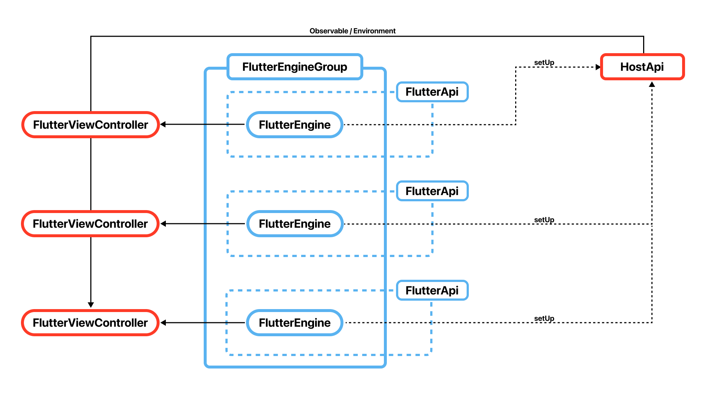

# アーキテクチャに関する話

- 接続は Pigeon を使用
- 画面ごとに FlutterEngine を生成し、FlutterViewController に紐付け
- FlutterEngine は FlutterEngineGroup で管理
- FlutterEngine ごとの FlutterApi をコールバックで扱えるようにし、HostApi に登録
- HostApi は Observable 準拠にし、Environment で共通化
